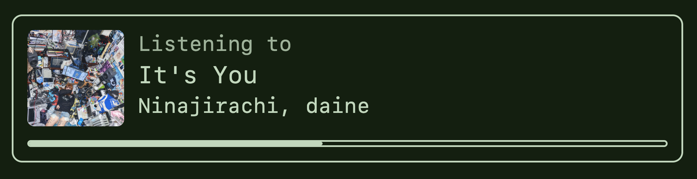

# Spotipub

An [SSE emitter](https://developer.mozilla.org/en-US/docs/Web/API/Server-sent_events/Using_server-sent_events) for real-time listening data so the whole world can know what I'm listening to on spotify. It powers little widgets like this on my website! 

<center>

</center>

---

## Usage

As a client, you can access spotipub in real-time via [Server-Sent Events](https://developer.mozilla.org/en-US/docs/Web/API/Server-sent_events/Using_server-sent_events).

```js
function onData(evt) {
    const data = JSON.parse(evt.data);
    if (!data.is_playing) {
        console.log("You're paused");
        return;
    }

    console.log(`You're listening to ${data.item.name}`)
}

const SPOTIPUB = "http://localhost:3000";
const ec = new EventSource(SPOTIPUB + "/sse") 

// fires with initial data
ec.addEventListener("initial", onData); 

// fires whenever something notable happens
// (user changes song, scrubs through song, pauses, etc)
ec.addEventListener("update", onData); 
```
### Shamelist

If you don't want to share 100% of your listening with the world, you can hide behind a shamelist like me.

```yml
# shamelist.yml

# a list of spotify item ids to exclude
items: 
    - 7MwwPyZJ7UKFROj2oVnH6R # caramelldansen

# list of spotify artist ids to exclude.
# if ANY of the artists of an item matches, it will be excluded
artists:
    - 72NhFAGG5Pt91VbheJeEPG #2hollis

# you get the idea at this point...
albums:
    - 7F81VnxiHp0jDJtQLcsZWo # can opener's notebook
```

> Notably, this will only hide from the `/sse` updates. Manually navigating to `/current` will ignore the shamelist.
> The `/current` route can also be very helpful in determining the Spotify ID of 
> the content you wish to distance yourself from :) 


## Hosting

Make sure you've created an app on the [spotify developer console](https://developer.spotify.com/dashboard).

| Environment Variable    | Description                               | Required |
| ----------------------- | ----------------------------------------- | -------- |
| `SPOTIFY_CLIENT_ID`     | The ClientID of your Spotify App          | `Yes`    |
| `SPOTIFY_CLIENT_SECRET` | The Secret of your Spotify App            | `Yes`    |
| `SPOTIFY_REDIRECT_URI`  | The deployed URL, followed by `/callback` | `Yes`    |
| `SHAMELIST_PATH`        | The path to your `shamelist.yml` file     | `No`     |

### Sample Docker-Compose

```yml
version: "3"
services:
    spotipub:
        build:
            # assumes working directory of 'spotipub'
            context: .
        ports:
            - 3000:3000
        environment:
            SPOTIFY_CLIENT_ID: XXXXX # no quotes
            SPOTIFY_CLIENT_SECRET: XXXXX 
            SPOTIFY_REDIRECT_URI: "http://127.0.0.1:3000/callback" # quotes here
```

### Auth Flow

Upon startup, a URL will be written to stdout.

```txt
 ✔ Container spotipub-spotipub-1  Creat...                                 0.0s
Attaching to spotipub-1
spotipub-1  | Please log into Spotify:  https://accounts.spotify.com/authorize?client_id=xxxxx&redirect_uri=http%3A%2F%2F127.0.0.1%3A3000%2Fcallback&response_type=code&scope=user-read-currently-playing&state=3cabfed21
```

Follow this link and sign in with your spotify account to finish the auth flow. Then, start playing a song and navigate to `/current` to see your song data! The song data on `/current` is the same shape of the data that's sent over `/sse`.
